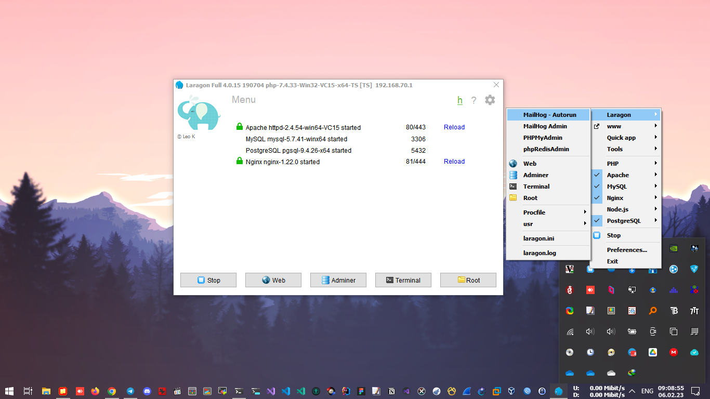

# laragon (webserver+rdbms)
Based on **https://github.com/leokhoa/laragon. **

This is my laragon suite (webserver+rdbms) settings for version 4.0.15. 
MySQL and MariaDB data can exist without rewriting each other in X:\laragon\data. 
But PostgreSQL data must be renamed, so that it can only be 1 "postgresql" folder in X:\laragon\data. 

Don't update cmder to the latest version. It makes error.

**Included Apache: **
X:\laragon\bin\apache\httpd-2.4.38-win64-VC11 
X:\laragon\bin\apache\httpd-2.4.41-win64-VC14 
X:\laragon\bin\apache\httpd-2.4.54-win64-VC15 (default) 
X:\laragon\bin\apache\httpd-2.4.55-win64-VS16 
X:\laragon\bin\apache\httpd-2.4.55-win64-VS17 

**Included NGINX: **
X:\laragon\bin\nginx\nginx-1.18.0 
X:\laragon\bin\nginx\nginx-1.20.2 
X:\laragon\bin\nginx\nginx-1.21.4 
X:\laragon\bin\nginx\nginx-1.21.6 
X:\laragon\bin\nginx\nginx-1.22.0 (default) 

**Included PHP+Xdebug+Opcache+com_dotnet: **
X:\laragon\bin\php\php-5.6.40-Win32-VC11-x64-TS 
X:\laragon\bin\php\php-7.0.33-Win32-VC14-x64-TS 
X:\laragon\bin\php\php-7.4.33-Win32-VC15-x64-TS (default) 
X:\laragon\bin\php\php-8.0.27-Win32-VS16-x64-TS 

**Included Redis for Windows: **
X:\laragon\bin\redis\redis-x64-3.2.100 
X:\laragon\bin\redis\redis-x64-4.014.2 
X:\laragon\bin\redis\redis-x64-5.0.14 (default) 

**Included Memcached: **
F:\laragon\bin\memcached\memcached-1.4.4-14-x32 
F:\laragon\bin\memcached\memcached-1.4.4-14-x64 
F:\laragon\bin\memcached\memcached-1.4.5 
F:\laragon\bin\memcached\memcached-1.6.7 (default) 

**Included Apps: Adminer, phpMyAdmin, phpRedisAdmin, MailHog, phpsysinfo.**

*Last update: 06 February 2023*
